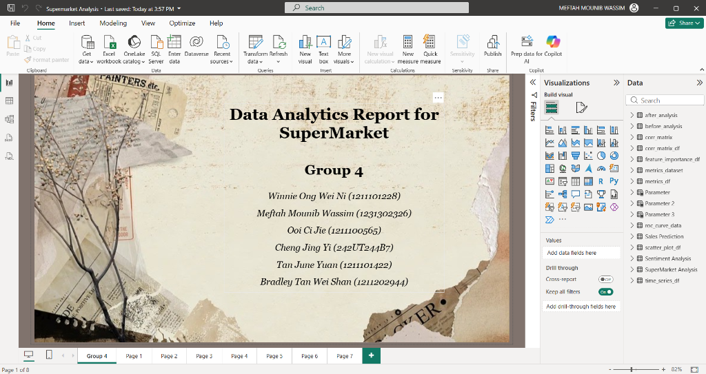
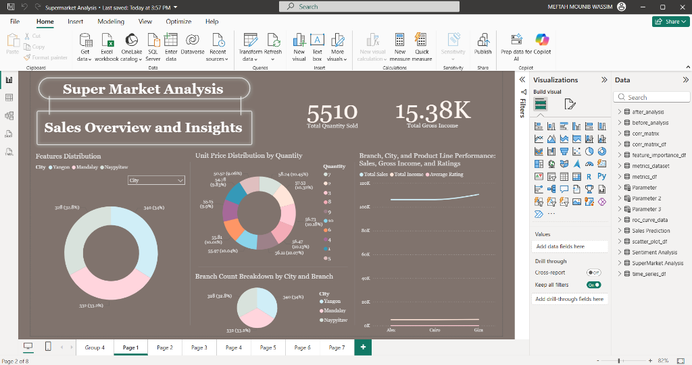
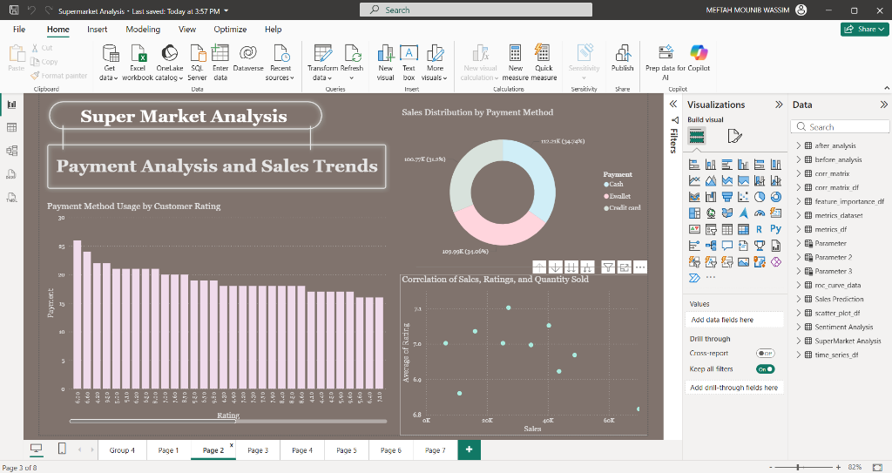
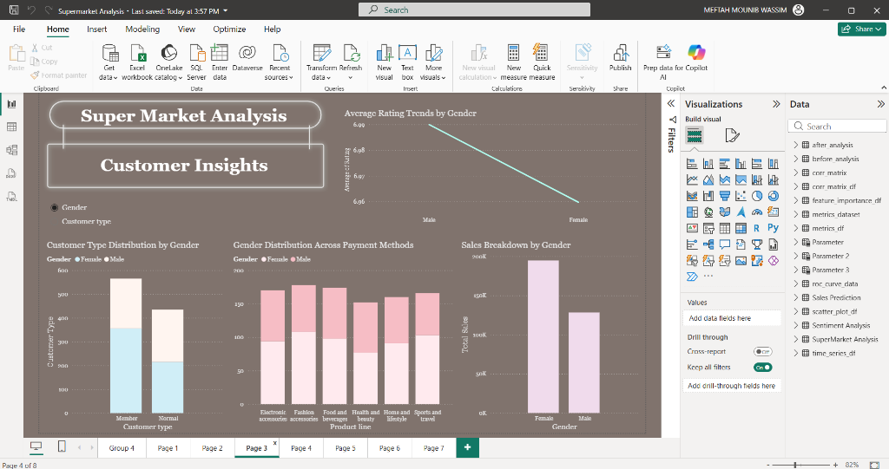
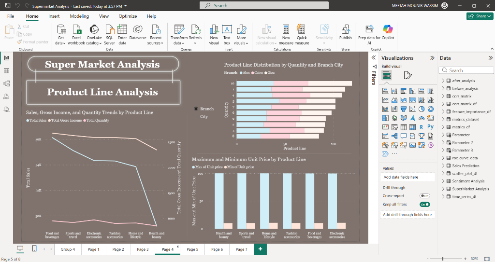
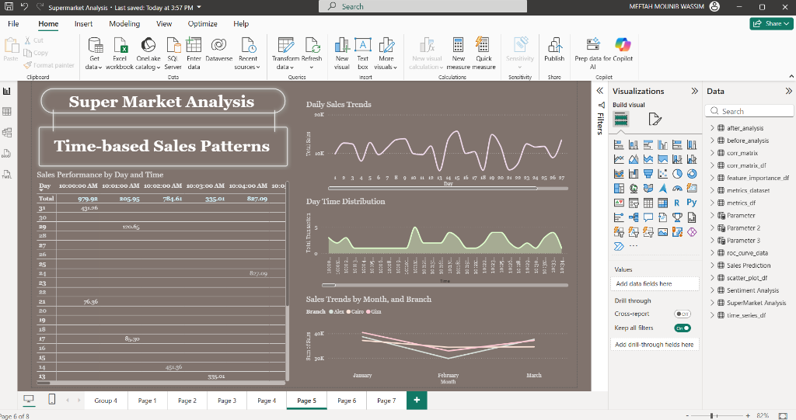
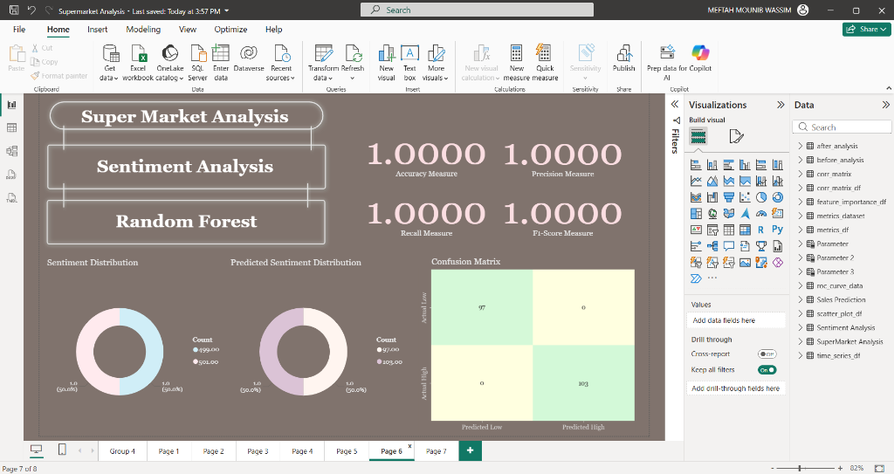
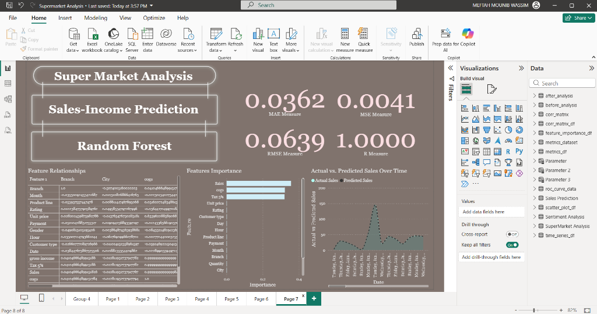

# Supermarket Data Analysis (Power BI)

## 🎯 Objective
This project presents a comprehensive Data Analytics Report for a Supermarket, utilizing **Power BI** to uncover interactive insights regarding sales performance, customer demographics, payment preferences, and product line trends across three main branches (Yangon, Mandalay, Naypyitaw). It also includes predictive analytics using **Random Forest** models to forecast sentiments and sales-income patterns.

**By:** Group 4 (Winnie Ong Wei Ni, Meftah Mounib Wassim, Ooi Ci Jie, Cheng Jing Yi, Tan June Yuan, Bradley Tan Wei Shan)

## 🛠️ Tools & Technologies
* **Power BI**: Interactive Data Visualization & Dashboarding
* **Machine Learning**: Random Forest (for Sentiment and Sales Prediction)
* **Data Sources**: Supermarket Sales Dataset

## 📈 Key Findings & Insights

Based on our interactive dashboards, the following business insights were discovered:
* **Overall Metrics**: The supermarket achieved a Total Gross Income of **15.38K** with **5,510** total items sold.
* **Geographic Distribution**: Sales and branch counts are distributed almost equally across all three cities (Yangon, Mandalay, Naypyitaw), indicating consistent performance across locations.
* **Customer Demographics**: Purchases are dominated by a near-even split between *Members* and *Normal* customers.
* **Payment Methods**: Customer payment preferences are highly balanced between Cash (34.7%), E-Wallet (34.0%), and Credit Card (31.2%).
* **Time-based Patterns**: Daily and monthly sales trends highlight specific peak times where transactions spike significantly during the day and month.
* **Predictive Analytics (Random Forest)**: 
  * The **Sentiment Analysis** model achieved perfect score metrics (Accuracy, Precision, Recall, F1 all at 1.0000).
  * The **Sales-Income Prediction** model demonstrates a highly accurate fit with an R-Measure of 1.0000 and minimal MAE/MSE tracking actual vs predicted sales.

---

## 🖼️ Dashboard Visualizations

Please see the screenshots below for the Power BI dashboard pages generated in this report:

### 1. Title Page

### 2. Sales Overview and Insights
Visualizing total income, geographic distributions, unit price vs. quantity, and overall branch performance.

### 3. Payment Analysis and Sales Trends
Exploring the correlation between sales, customer ratings, and chosen transaction methods.

### 4. Customer Insights
Diving into customer types, gender-based purchasing behavior, and average rating trends.

### 5. Product Line Analysis
Tracking quantity, unit price spans, and overall gross income across all 6 main product categories.

### 6. Time-based Sales Patterns
Tracking sales performance across days probabilistically, including daytime transaction distribution and monthly trends by branch.

### 7. Sentiment Analysis (Random Forest)
Predictive modeling results for sentiment distribution, featuring the Confusion Matrix and evaluation metrics (Accuracy, Precision, Recall, F1-Score).

### 8. Sales-Income Prediction (Random Forest)
Forecasting actual vs. predicted sales with detailed feature importance analysis and model error metrics (MAE, MSE, RMSE).

---

## 🚦 How to View
To interact with the actual data:
1. Ensure you have **Power BI Desktop** installed on your machine.
2. Download the `.pbix` file from this directory.
3. Open the file to interact with the visualizations natively.
